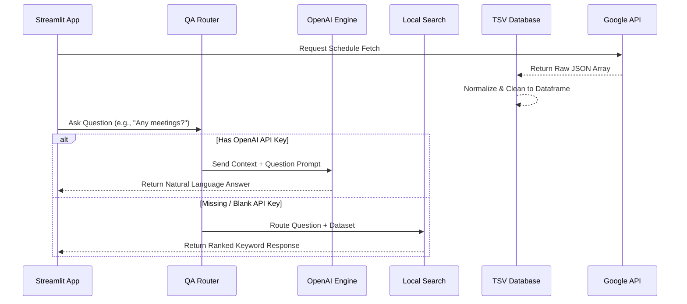

# Schedule Assistant AI

## 1. Project Overview
Schedule Assistant AI is a polished, production-ready AI workflow scheduling tool designed to extract calendar and event data directly from Google Sheets. It leverages the cutting-edge reasoning capabilities of OpenAI to provide intuitive answers about schedules, detect conflicting meeting blocks, generate dynamic summaries, and even seamlessly drop back to an independent algorithmic search engine if the API key is missing.

This acts as a smart "Copilot" for any calendar dynamically hosted within Google ecosystem!

## 2. Features List
* **Google Sheets Integration:** Connects seamlessly to any Google Sheet via service accounts.
* **Smart Data Processing:** Parses raw inputs, automatically determines event categories, detects datetimes, and securely drops `.tsv` snapshots.
* **Hybrid Q&A Model:** 
  * Primary: **OpenAI Responses**. Highly conversational QA engine.
  * Secondary: **Fallback Kernel**. In circumstances without access to internet LLMs, seamlessly enables keyword searching, date filtering (e.g., "today", "tomorrow"), and relevant result clustering.
* **Conflict Detection Engine:** Analyzes timeblocks to preemptively warn of schedule overlaps.
* **Weekly Insights Summary:** Rapidly delivers event breakdowns, pinpoints the busiest calendar day, and aggressively flags important interviews.
* **Dual Interface Design:** Includes an interactive `Streamlit` Web UI as well as a flexible Command Line Interface (`cli`).
* **Robust Error Handling:** Cleans up configuration typos natively, captures API throttling faults, and handles invalid row parses securely.

## 3. Tech Stack
* **Language:** Python 3.11+
* **Framework/UI:** Streamlit
* **ETL Engine:** google-api-python-client, google-auth
* **Language Logic Inference:** OpenAI API (`gpt-4.1-mini`)
* **Data Processing Logic:** Native standard libraries `csv`, `datetime`, `collections`
* **Test Suite Framework:** `pytest`

## 4. Architecture Explanation
The application is structured defensively using a layered component approach internally under `src/schedule_assistant`:
1. `config.py`: Single source of truth evaluating environment settings.
2. `sheets_client.py`: Network translation layer to interface explicitly with `googleapis`.
3. `parser.py`: Engine converting unstable lists into heavily structured TSV database rows parsing string-times to true ISO `datetime`.
4. `insights.py`: Logic block comparing structured TSV to deduce summaries and overlaps mathematically.
5. `fallback.py`: Zero-dependency ranking algorithm substituting an LLM. 
6. `qa.py`: Dynamic routing junction determining if questions are routed through `fallback.py` or the OpenAI REST module.
7. `cli.py` & `app.py`: Outer surface bindings bringing the architecture onto screens.



## 5. Setup Instructions

### Environment
1. Clone the repository and navigate inside the directory.
2. Setup a Python Virtual Environment:
   * **Windows:** `python -m venv venv` and `.\\venv\\Scripts\\activate`
   * **Mac/Linux:** `python3 -m venv venv` and `source venv/bin/activate`

### Install Dependencies
Run the installation script:
```bash
pip install -r requirements.txt
```

### Configure Credentials
1. Copy the example envelope variables: `cp .env.example .env`
2. Populate the parameters in `.env`:
   - `GOOGLE_APPLICATION_CREDENTIALS` (e.g., `path/to/my-service-account.json`)
   - `SPREADSHEET_ID` 
   - `SHEET_RANGE` (e.g., `Sheet1!A1:D50`)
   - `OPENAI_API_KEY` (Leave blank if you wish to see Fallback Engine functionality)
   - `OPENAI_MODEL` (Default: `gpt-4.1-mini`)

## 6. Run Instructions

### Web Mode (Streamlit)
To visualize the interface, dashboard, data frames, and graphical insights:
```bash
streamlit run app.py
```

### Terminal Mode (CLI)
Interact purely from the console. Use `--skip-fetch` to query against cached `whatsdata.tsv`.
```bash
python main.py --fetch
python main.py --insights
python main.py --skip-fetch --ask "When is my engineering interview?"
```

### Testing Suite
Validation operations ensuring architectural stability:
```bash
pytest tests/
```

## 7. Example Questions
* "What is happening tomorrow?"
* "Do I have any meetings next week?"
* "What time is my interview with Google?"
* "Are there any scheduling conflicts on Wednesday?"

## 8. Interface Screenshots

*(Screenshot Placeholder - Add visual of the Streamlit App)*

## 9. Resume Ready Description
**AI Schedule Automation Framework**
Engineered a comprehensive AI-powered scheduling pipeline bridging live Google Sheets data to a natural-language Query engine via OpenAI's generative models and Streamlit. Devised a robust offline "fallback" natural language processing algorithm handling date queries dynamically. Included built-in algorithmic resolution for conflict overlap detection, rigorous Pytest coverage, and strict structured layered configuration modeling ensuring zero system disruption.

## 10. Future Improvements
- **Google Calendar Writing Engine:** Allow users to write missing blocks directly to standard calendar.
- **RAG Implementation:** Enable indexing multiple spreadsheets efficiently.
- **Dynamic NLP Filtering:** Connect `LangChain` primitives for zero-shot intent filtering before LLM usage.
